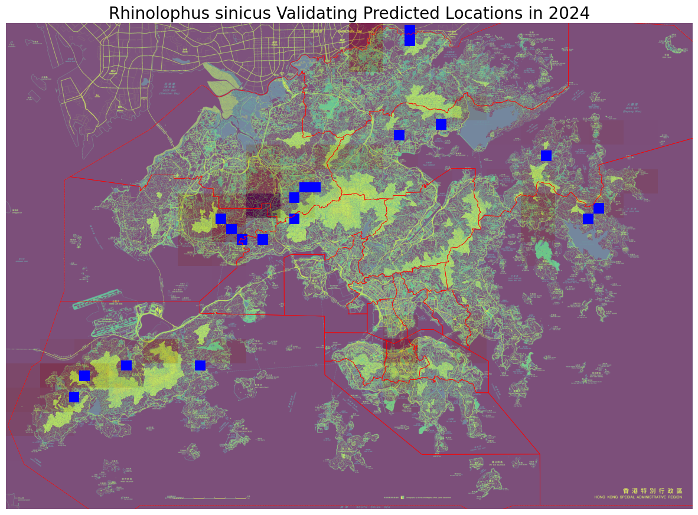

# Hong Kong Species Prediction API
Interactive web application through **AWS Lightsail** for exploring Hong Kong's biodiversity with 2025 species occurrence predictions estimated by a Convolutional Neural Network with Long Short-Term Memory (CNN-LSTM) `deep learning` model.

## File Structure
hkspecies/  
├── boundaries/ &emsp;&emsp;&emsp; # Hongkong boundaries in shapefile  
├── predictions_cache/ &emsp;&emsp; # Precomputed predictions for each species in Hongkong  
├── processed/ &emsp;&emsp;&emsp; # Processed geospatial data including districts and species occurrences from all available years  
├── species/ &emsp;&emsp;&emsp;# Raw datasets obtained from [Esri](https://opendata.esrichina.hk/maps/esrihk::occurrence-data-of-hong-kong-species/about)  
├── app.py &emsp;&emsp;&emsp;# FastAPI server script by Amazon Q Developer  
├── data_processor.py &emsp;&emsp; # Initial data processing pipeline  
├── frontend.html &emsp;&emsp;# Frontend UI by Amazon Q Developer  
├── hk.tif &emsp;&emsp;&emsp; # A raster file for Hongkong map display  
├── precompute_predictions.py &emsp; # Generate precomputed predictions  
├── README.md &emsp;&emsp;&emsp; # This file  
├── requirements.txt &emsp;&emsp; # Required Python libraries  
├── species_inference.py &emsp; # Predictive modelling functions  
├── species_lookup.ipynb &emsp; # Data exploration  
├── species_model.ipynb &emsp;# EDA and predictive modelling  
│    
└── README.md &emsp;&emsp;&emsp; # This file  

## Features
- **Species Search & Exploration** - Browse 1000+ Hong Kong species
- **Interactive Maps** - Visualise species occurrences with `Leaflet` maps
- **AI Predictions** - `CNN-LSTM` predictions for 2025 species locations
- **Real-time Data** - Species occurrence data from 2001-2024
- **Responsive Design** - Works on desktop and mobile devices

## Production Deployment (AWS Lightsail)
- AWS CLI configured
- AWS Lightsail access

## Data Preprocessing
- The Hongkong map was divided into 20x20 grids for simplification.
- The *target* variable (location) was the grid ID.
- Each species has its own array with shape, (24, 20, 20), storing number of occurrences in each year.

## Deep Learning Model
- **CNN-LSTM** ([ndrplz](https://github.com/ndrplz/ConvLSTM_pytorch))
- **Training**: Adam optimizer, BCE loss, 100 epochs with early stopping.
- Output example (Predictions: Shades of red; Actual occurrences: blue squares):

## 🎯 Use Cases
1. **Research & Education** - Explore Hong Kong biodiversity
2. **Conservation Planning** - Predict future species distributions
3. **Environmental Monitoring** - Track species occurrence trends
4. **Public Engagement** - Interactive species exploration
